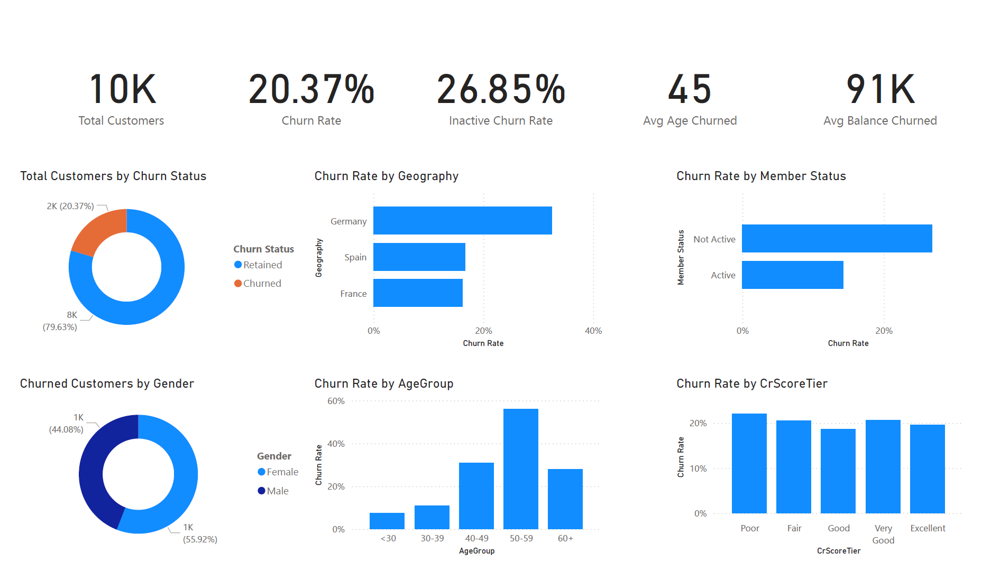

# Bank Customer Churn Analysis

Interactive Power BI dashboard analyzing customer churn behavior using a synthetic dataset of ~10,000 European bank customers.

## Project Overview
This project explores why customers are leaving the bank by analyzing demographics, account activity, credit scores, and geography (France, Germany, Spain).  

The goal was to identify key drivers of churn and recommend retention strategies.

## Files Included
- **Bank_Churn_Data.xlsx** – Raw data, PivotTables, and EDA  
- **Bank_Churn_Dashboard.pbix** – Full interactive Power BI dashboard  
- **Bank_Churn_Analysis_Report.pdf** – Detailed written report with insights and recommendations

## Tools Used
- Excel: Data cleaning, PivotTables, initial EDA  
- Power BI: Interactive visualizations and dashboard

## Key Insights
- Overall churn rate is **20.37%**, rising to **26.85%** among inactive customers.  
- Churn is significantly higher for customers with only 1 product, low credit scores, and ages 40–60.  
- Germany has the highest churn rate among the three countries.  
- Inactive customers with low account balances are at the greatest risk of leaving.

## Recommendations
- Target retention offers at inactive customers with only 1 product.  
- Focus cross-selling efforts to increase number of products per customer.  
- Monitor customers aged 40–60 and those with lower credit scores more closely.

## Dashboard Preview

